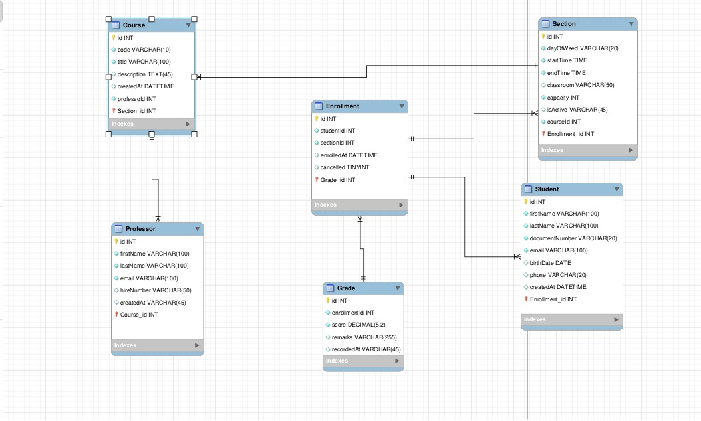

# Pasos Guias para El desarrollo

 1 - Termina de crear tus entidades en domain si falta algo sino continua.
 
 2 - Crea las interfaces que necesitas para los repositorios recuerda el correcno nombrado de estas (I + [nombre] + Repository.cs) va en interfaces de domain.

 3 - Implementa en Repositories tus repositorios implementando tu logica de base de datos y tus interfaces.

 4 - Application crea tus DTOS segun tus necesidades usa StudentDto como ejemplo ahi mismo hay varios segun la necesidad.

 5 - Crea interfaces que expongan los Dtos tanto para retornar como parametros

 6 - Desarrolla tus servicios implementando las interfaces de los Dtos Mapea las clases a dtos y asi podras usar el dto.

 7 - En api crea tus controladores de manera logica y en program llama dicho controlaodr con scopped.

## Diagrama:

## Repo de referencia que implementa dtos:
https://github.com/JavierDevPro/InstitutionManagement.git

 
